# NVIDIA_AzureML Components and Pipelines

This repo contains the material to produce and publish the AzureML Environments, Command Components and Pipeline Components based on NVIDIA products contained in the multitenant AzureML Registry: https://ml.azure.com/registries/NVIDIA-NGC-Test.

The user would be able to reproduce the content on the https://ml.azure.com/registries/NVIDIA-NGC-Test Registry and then submit pipeline job using that content or the user could submit a pipeline job using the already available content on the NVIDIA Registry

The main folders in this repo are:

* components
* pipelines
* environments
* compute_clusters
* scripts

## Components

Contains the definitions to create AzureML Components (Functional pieces of code) wrapped around NVIDIA Products Commands 

They are divided by NVIDIA product, i.e.: Tao, Triton, Rapids. Since components are tied to AzureML Environments, for each product, components are then subdivided by the container they are associated with. AzureML Components associated with the same NVIDIA product command (functional piece of code) would use their versioning to map them to a particular AzureML Environment (NVIDIA product container). If a particular NVIDIA product further subdivides their commands into for instance user cases, such subdivision would be reflected on the subdirectory structure for such NVIDIA product.

Each component definition folder has the yml file defining the inputs and outputs of the components, the scripts needed to run the code associated with the component and a README.md file that explains how the component is mapped into the NVIDIA product commands. More details on Azureml Components below

## Pipelines

Contains the definition of end-to-end user cases as AzureML Pipelines

They are also divided by NVIDIA product, container (tied to the versioning of the components used on the pipeline) and product subdivision, if any.

Each pipeline definition folder has the yml file defining the jobs interconnecting the corresponding components, and a README.md file that explains the end-to-end user case implemented by the pipeline and what are the expected results and how they could be deployed to production using the scripts on the deployment_scripts

### Deployment Scripts
Pipelines contain end-to-end user cases that produce a model or a set of models as output, each pipeline has a folder deployment_scripts that has the scripts the user needs to run to deploy the model(s) into an AzureML Inference Endpoint

The deployment scripts migth later being converted into pipelines themselves

## Environments

Contains the definition of AzureML Environments having as base images specific NVIDIA NGC containers

They are also divided by NVIDIA product and container

## Compute_Cluster

Contains the definition of AzureML Compute Clusters using Azure VM Sizes that support NVIDIA GPUs

The folder is subdivided by VM Size

## AzureML Resources

### AzureML Registries
[Registries in Azure Machine Learning](https://techcommunity.microsoft.com/t5/ai-machine-learning-blog/announcing-registries-in-azure-machine-learning-to/ba-p/3649242)  are organization wide repositories of machine learning assets such as models, environments, and components. Registries provide a central platform for cataloging and operationalizing machine learning models across various personas, teams and environments involved in the machine learning lifecycle. 

If the user wants to recreate the AzureML Environments and Components in its own Registry then the user should first create its own Registry

Go to the Azure Portal and on the search box type "Azure Machine Learning"

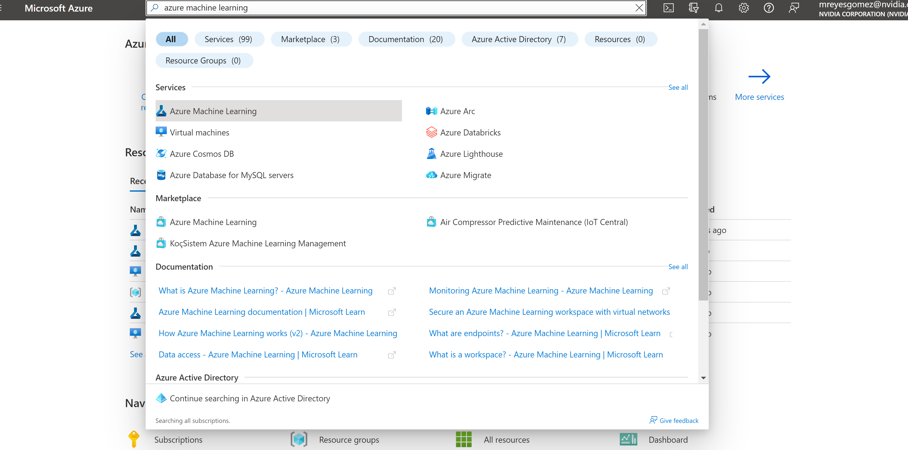

Click into the Azure Machine Learning link

Then select the create a new registry option

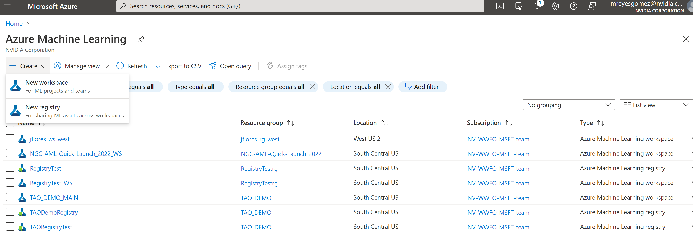

Fill the details

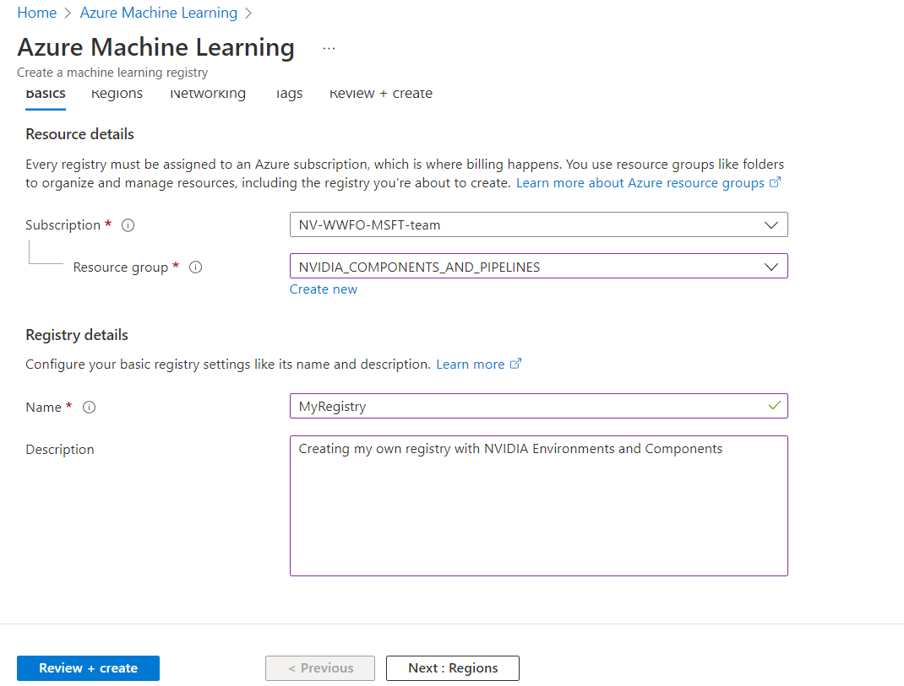

Choose Rrgions

Then click "Review and Create"

### AzureML CLI

All the material in this repo require the use of the [AzureML CLI V2.0](https://learn.microsoft.com/en-us/azure/machine-learning/how-to-configure-cli?tabs=public)

If you do not have it installed please run:

<pre style="background-color:rgba(0, 0, 0, 0.0470588)">bash scripts/install_libs.sh
</pre>

To interact with the material, the user needs to provide its AzureML Information along with the NVIDIA Product to use, the container and the VM Size by filling the environmental variables at file: scripts/config_files/config.sh

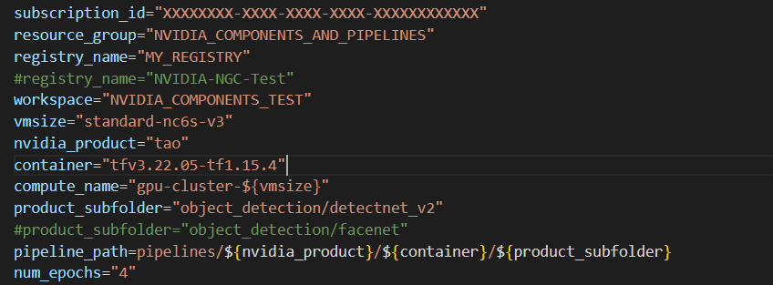

If a user wants to use a previously provisioned compute cluster, the user would need to change the "compute_name" variable to the one of the desired compute cluster

Before running any of the material the user needs to pass its AzureML credentials by running:

<pre style="background-color:rgba(0, 0, 0, 0.0470588)">bash scripts/set_credentials.sh
</pre>

### AzureML Environment
Before being able to define an AzureML Component, you would need to define and create an [AzureML Environment](https://learn.microsoft.com/en-us/azure/machine-learning/how-to-manage-environments-v2?tabs=cli)

We will use the "Create an environment from a Docker build context" option that you can see in the link above

The environment is created by running

<pre style="background-color:rgba(0, 0, 0, 0.0470588)">bash scripts/set_environment.sh
</pre>

Also please pay attention to the version number variable on the yml file. any change on the Dockerfile requires an increment in the version number for the change to go through and take effect. You also would need to update the version number used on the Components associated with such Environment

The user can confirm that the Environment was created by launching the Azure Machine Learning Studio for the specified Workspace:

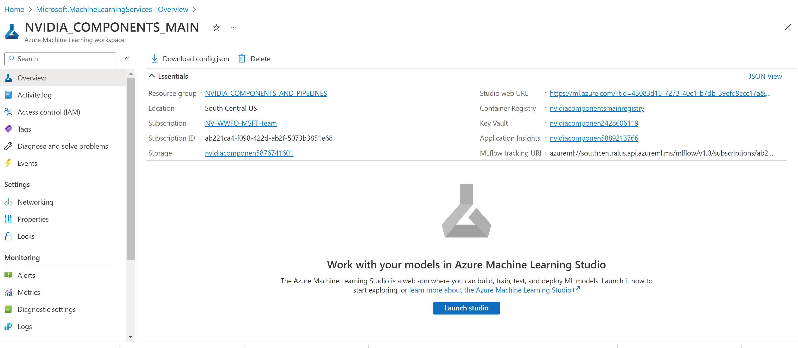

And then navigating to the Environments tab

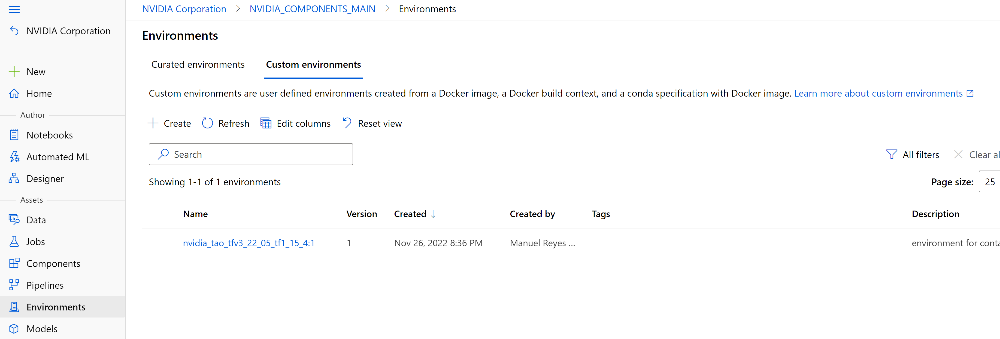

### AzureML Components
[AzureML Components](https://docs.microsoft.com/en-us/azure/machine-learning/how-to-create-component-pipeline-python) are functional pieces of code that are meant to be used repeatedly

Regular command components are specified by the following schema: https://azuremlschemas.azureedge.net/latest/commandComponent.schema.json

They are defined by a yml file

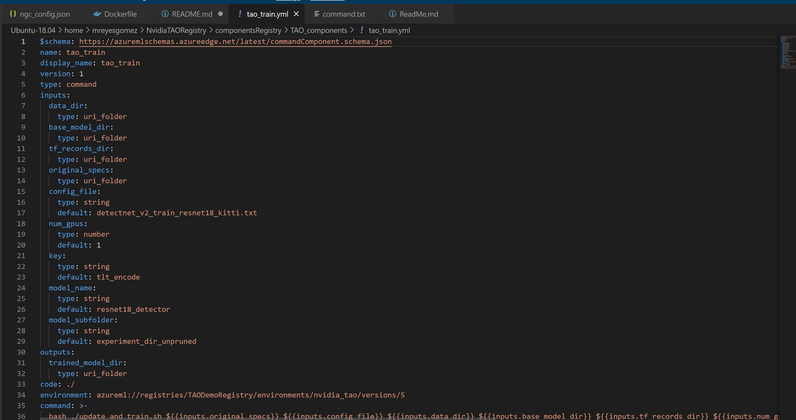

That specifies the name, number and nature of its inputs and outputs

It also specifies the AzureML Environment to use

The code that the component would execute is defined in the command variable

The yml file also specifies the Component version number, once a Component is created any changes on its definition or the code associated with it would require an increase on its version number to be able to update the Components functionality

In this case the yml file refers to a bash script thats in turn runs two other scripts

One just changes the config file that the actual command would use, and the other tao_train.sh is the wrapper for the actual TAO command:

A restriction that pipelines have is that inputs are Read-Only so whatever changes you want to do an input they need to be saved as an output. also outputs can not be shared between components so resources produced by a component run need to be stored on its own folder. This is done by design to be able to track what component produced what output.

To create all the components for the NVIDIA product and container specified on the scripts/config_files/config.sh file. The user should run:

<pre style="background-color:rgba(0, 0, 0, 0.0470588)">bash scripts/set_components.sh
</pre>

Once Components have been created you should be able to see them on the AzureML Portal

Navigate to the Microsoft Azure Machine Learning Studio for your Workspace and then navigate to the Components tab 

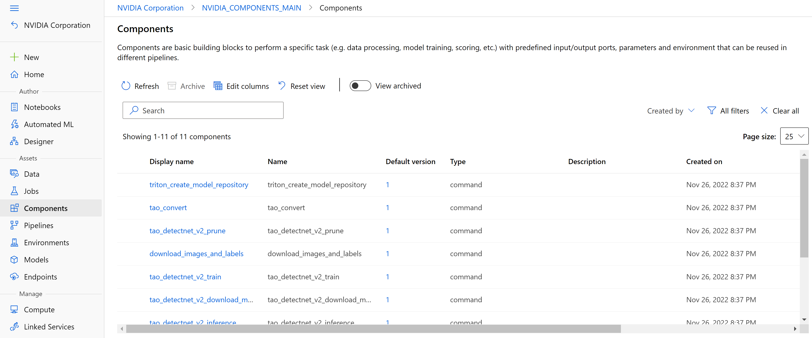

### AzureML Compute Cluster

If a user wants to use a previously provisioned compute cluster, and had changed the "compute_name" variable on the scripts/config_files/config.sh file to reflect that then this step is NOT required and it will throw an error 

Before being able to submit an AzureML Job using a pipeline that uses the created components, the user needs to set up a compute resource to run the following script:

<pre style="background-color:rgba(0, 0, 0, 0.0470588)">bash scripts/set_compute_cluster.sh
</pre>

### AzureML Pipeline

An [AzureML Pipeline](https://learn.microsoft.com/en-us/azure/machine-learning/how-to-create-component-pipelines-cli) describes the interconections between multiple AzureML Components, a particular Run with specific inputs and outputs of a Component is called a Job, a Component could be called multiple times under different Job Names.

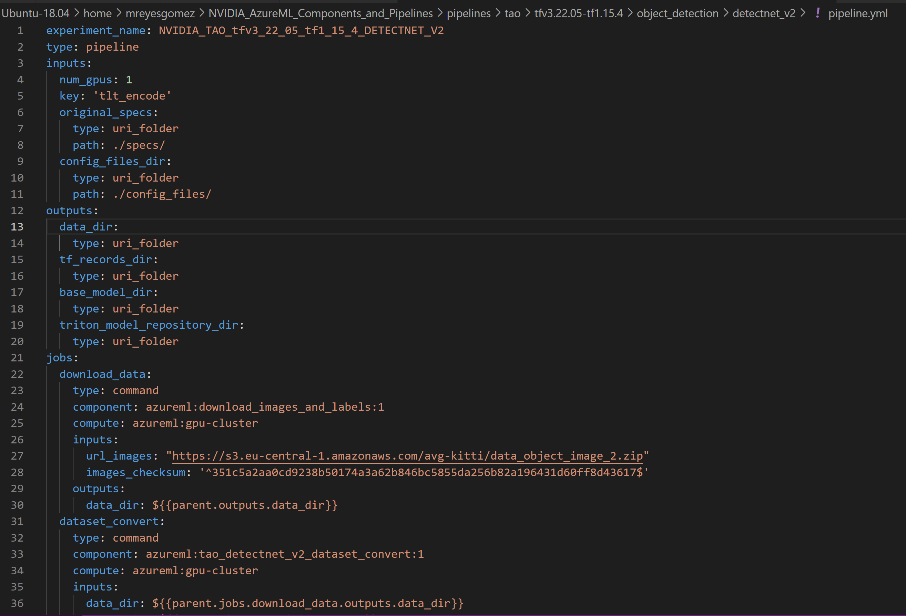

Notice that each component job has an associated Compute Resource, the pipeline inputs have to be defined. In particular uri_folder inputs need to refer to local folders from the machine where the pipeline job is submitted  

The pipeline file defines the interactions between Components, specifying what Components outputs are feed to which Components inputs:

The desired pipeline is submitted by using:

<pre style="background-color:rgba(0, 0, 0, 0.0470588)">bash scripts/run_pipeline.sh
</pre>

To control the number of epochs use for training the models, the user should use the num_epochs environmental variable in the config file: scripts/config_files/config.sh. For simple experementation the user should choose a value between 3-5. To produce a high performing model the value should be above 100

If the submission succeeds you should be able to see the job runing on the Azure Portal, it would be running under the desired Workspace

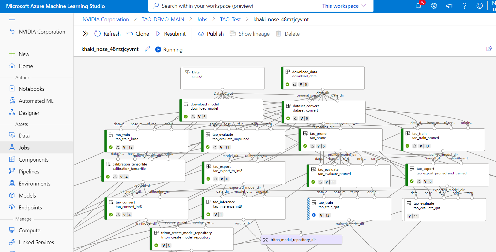

### AzureML Pipeline Component

Pipeline yml files as they are can not be shared and run automatically by a given AzureML user as they contain information specific to the user, such as the local location of the uri_folders and the name of the Compute. However the information with respect to the interaction of inputs and outputs within Components is user independent and very useful to share. 

A Pipeline Component is a multi-components Component that defines the user specific information, including the Compute name as variables to be passed during execution time, but that defines multiple Component Jobs and their input-output interactions just as a pipeline defintion yml file would do

Pipeline components are specified by the following schema: https://azuremlschemas.azureedge.net/latest/pipelineComponent.schema.json

As the AzureML Pipeline Component is in private preview, its usage requires setting the following environmental variable

<pre style="background-color:rgba(0, 0, 0, 0.0470588)">export AZURE_ML_CLI_PRIVATE_FEATURES_ENABLED=true
</pre>

An example of the above Pipeline as a Pipeline component is the following:

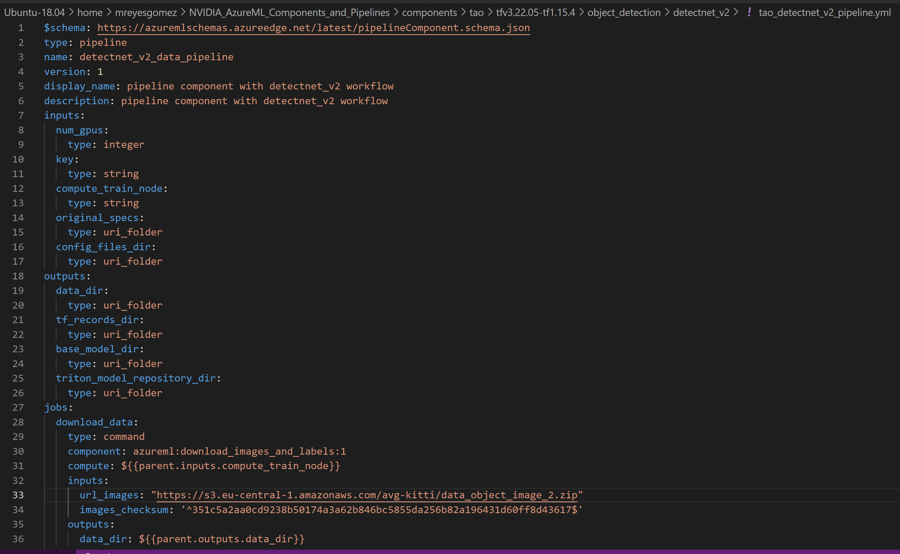

#### Submiting an AzureML Pipeline Component
A pipeline yml file is still required, but its a much simpler file as it only defines the inputs and the final outputs of the workflow

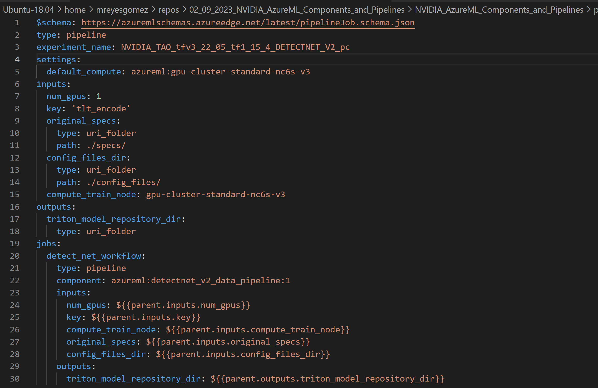

The pipeline run on the AzureML Studio would look like:

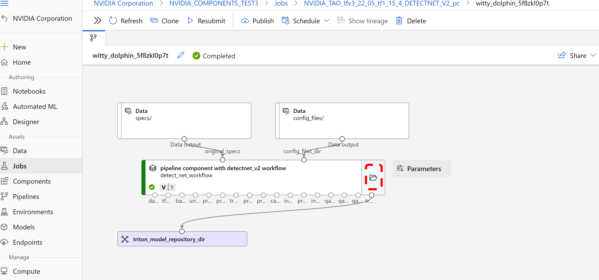

If the user clicks on the folder icon the whole workflow appears just as in the previous submission

### AzureML Inference Endpoint

Pipelines contain end-to-end user cases that produce a model or a set of models as output, each pipeline has a folder deployment_scripts that has the scripts the user needs to run to deploy the model(s) into an AzureML Inference Endpoint

Once the pipeline job has been succesfully completed, the user can now deploy the produced models by going to the corresponding pipeline folder and follow the deployment instructions in the pipeline README.md file

To navigate to the pipeline folder the user should run:

<pre style="background-color:rgba(0, 0, 0, 0.0470588)">source scripts/config_files/config.sh
cd $pipeline_path
</pre>
